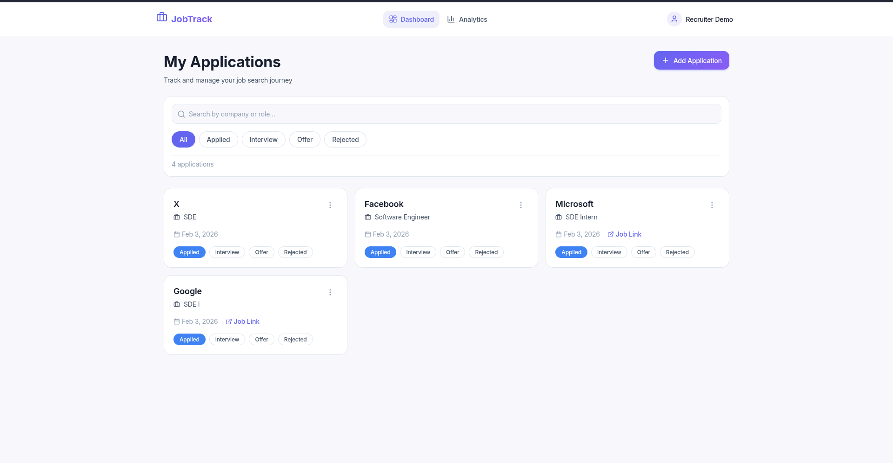
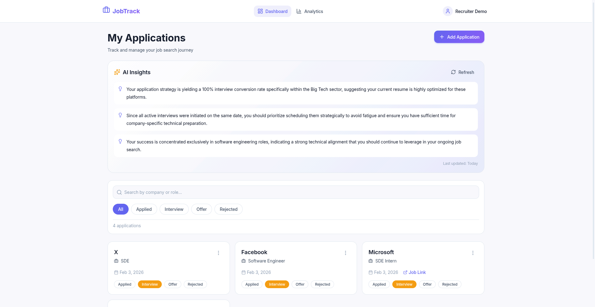
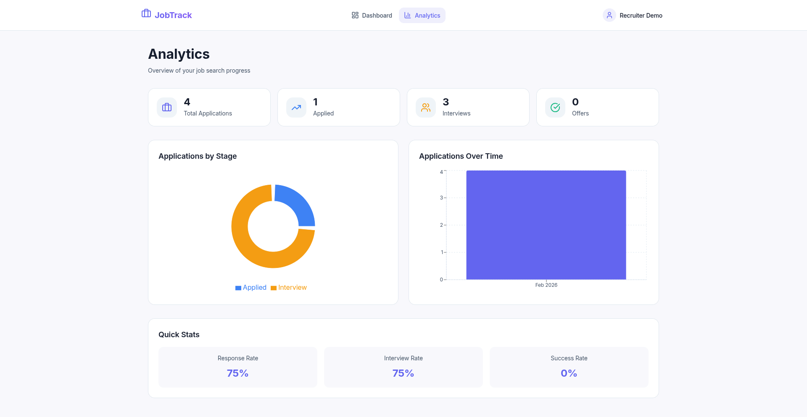
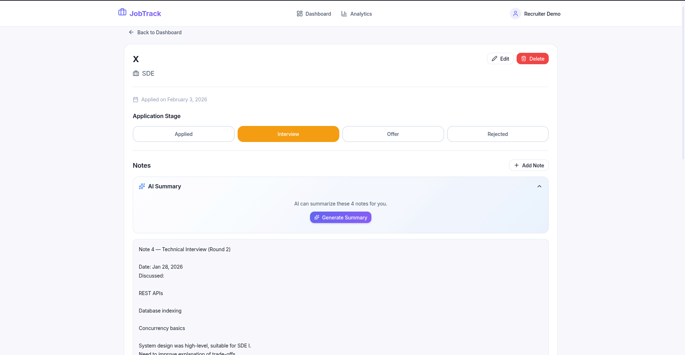
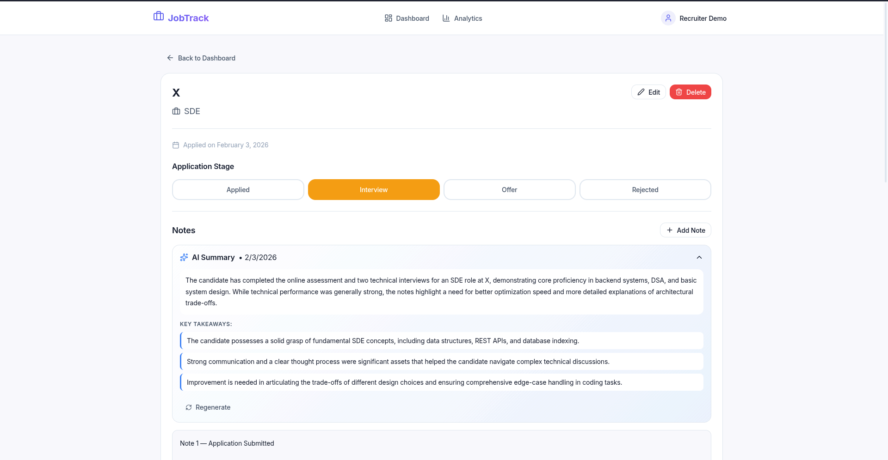

# JobTrack 🚀

**An Intelligent, AI-Powered Job Application Tracker**

JobTrack is a modern, full-stack application designed to streamline the chaotic job search process. Built with **React**, **TypeScript**, and **Firebase**, it leverages **Google's Gemini AI** to provide actionable insights and smart note summarization, helping users stay organized and focused.



## ✨ Key Features

### 🧠 AI-Powered Intelligence
- **Smart Application Insights**: Analyzes your application history to provide 2-4 actionable tips and trends. Powered by a resilient multi-model fallback chain (Gemini 3 Pro → Flash → 2.5).
- **Note Summarizer**: Instantly condenses lengthy interview notes into concise summaries and key takeaways using AI.
- **Resilient Architecture**: Automatically handles API rate limits by switching models and logging issues to Firestore.



### 📊 Comprehensive Analytics
- **Visual Progress Tracking**: Beautiful charts and graphs to visualize your job search journey.
- **Stage Distribution**: See exactly where your applications stand at a glance.
- **Activity Timeline**: Track your application velocity over time.



### 🎨 Premium User Experience
- **Modern Design System**: Custom-built CSS variable system with glassmorphism, premium gradients, and smooth animations.
- **Dark Mode Support**: Fully responsive dark theme that respects user preferences.
- **Interactive UI**: Shimmer loading states, toast notifications, and seamless transitions.

### 🛠️ Core Functionality
- **Kanban-style Tracking**: Manage applications through Applied, Interview, Offer, and Rejected stages.
- **Advanced Filtering**: Real-time search and stage-based filtering.
- **Detailed Management**: maintain comprehensive notes and details for every application.



## 🏗️ Tech Stack

- **Frontend**: React 18, TypeScript, Vite
- **Styling**: Vanilla CSS (CSS Variables, Flexbox/Grid), Lucide React Icons
- **Backend-as-a-Service**: Firebase (Auth, Firestore)
- **AI Integration**: Firebase AI Logic SDK, Google Gemini Models
- **Visualization**: Recharts for analytics

## 📸 Feature Gallery

| Login Process | AI Note Summaries |
|---------------|-------------------|
|  |  |

## 🚀 Getting Started

1. **Clone the repository**
   ```bash
   git clone https://github.com/yourusername/jobtrack.git
   ```

2. **Install dependencies**
   ```bash
   npm install
   ```

3. **Configure Firebase**
   - Create a project at [console.firebase.google.com](https://console.firebase.google.com)
   - Enable Authentication (Email, Google, GitHub) and Firestore
   - Enable **Firebase AI Logic** with Gemini API
   - Copy `.env.example` to `.env` and fill in your credentials

4. **Run the app**
   ```bash
   npm run dev
   ```

---

*Built with ❤️ for ambitious job seekers*
