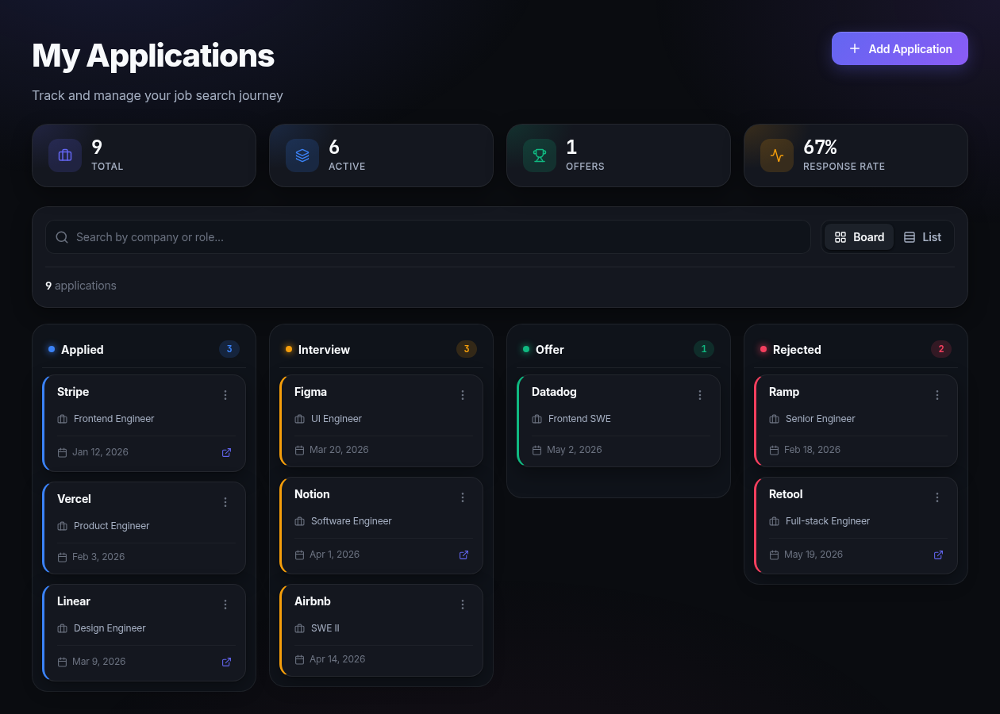
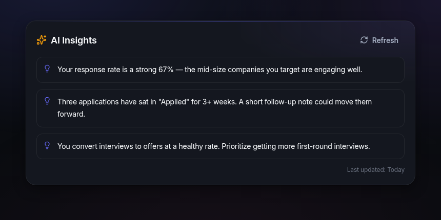
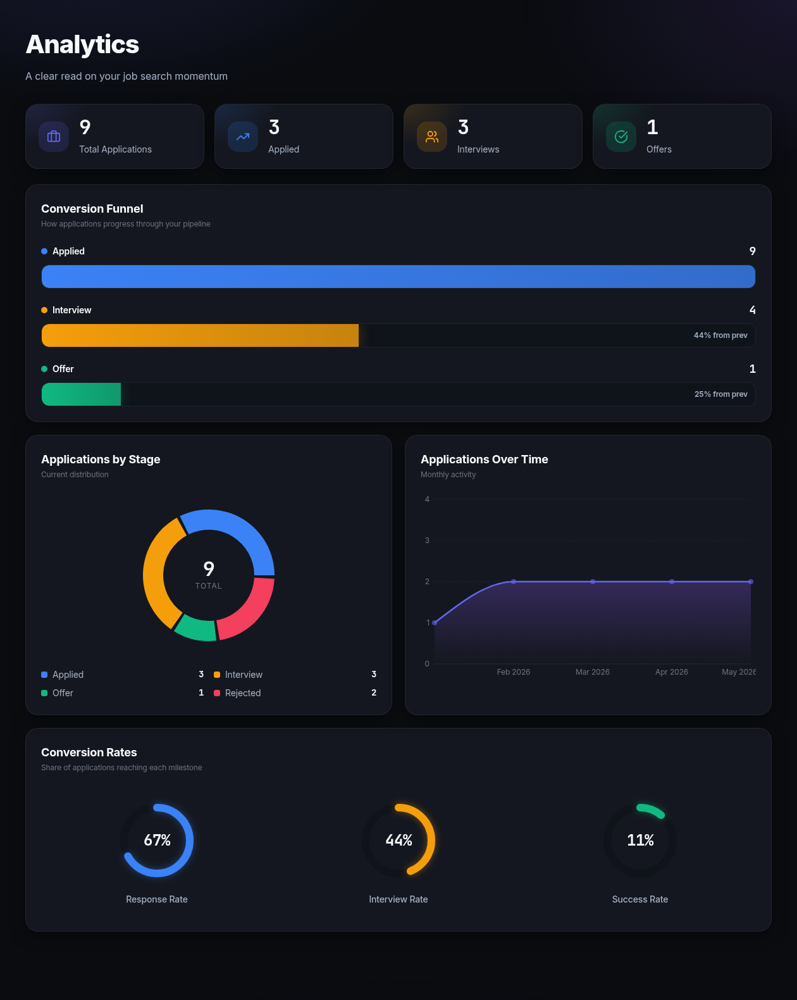
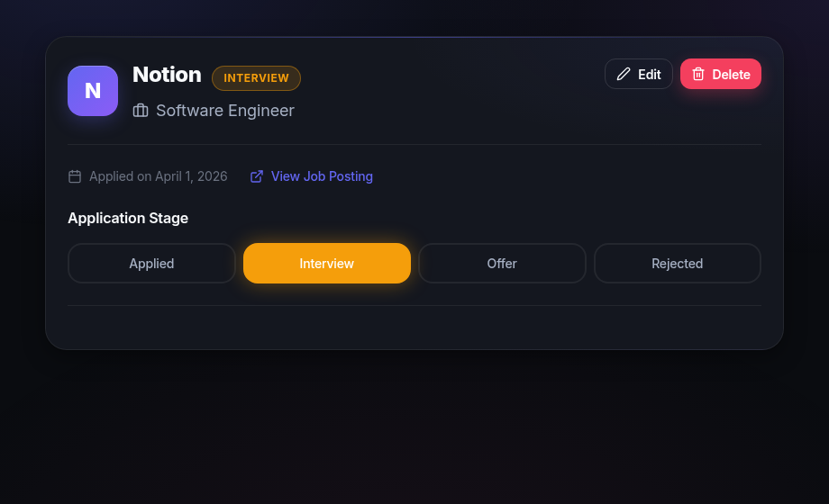
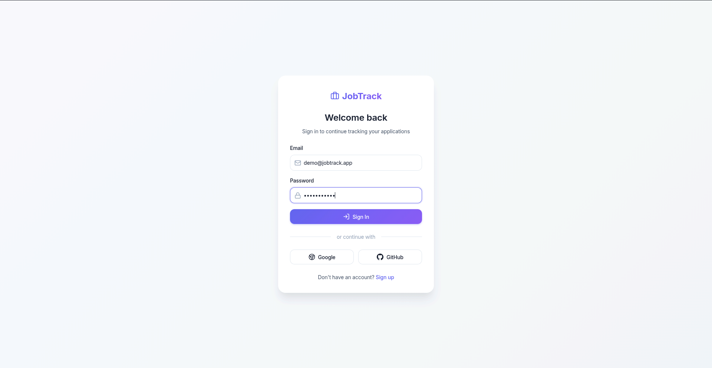

# JobTrack - AI-Powered Application Tracker

[](https://react.dev/)
[](https://www.typescriptlang.org/)
[](https://firebase.google.com/)
[](https://vitejs.dev/)
[](https://ai.google.dev/)

**Live Demo:** [jobtrack.mohammedusmani.me](https://jobtrack.mohammedusmani.me)  
**Repository:** [github.com/Mohammed6903/JobTrack](https://github.com/Mohammed6903/JobTrack)

## Overview

**JobTrack** is a modern, full-stack productivity tool designed to streamline the chaotic job search process. Built with **React** and **TypeScript**, it leverages **Google's Gemini AI** to provide actionable intelligence on job descriptions and automated note summarization.

This project demonstrates proficiency in building scalable frontend architectures, integrating complex third-party APIs (Firebase, Gemini AI), and creating data-driven visualizations.



## Key Features

### AI-Powered Intelligence
- **Smart Resume Analysis:** Uses Google's Gemini AI to analyze job descriptions against user profiles, offering 2-4 actionable tips to improve application success rates.
- **Automated Summaries:** Instantly condenses lengthy interview notes into concise takeaways and next steps.
- **Robust Model Fallback:** Implements a resilient AI chain (Gemini 2.5 → Flash → Pro) to ensure reliability even during high traffic or rate limiting.

### Interactive Analytics
- **Visual Progress Tracking:** Powered by `recharts`, users can visualize their application velocity, stage distribution, and success rates over time.
- **Data-Driven Insights:** Helps users identify bottlenecks in their application process (e.g., failing at the resume stage vs. interview stage).

### Advanced Job Management
- **Kanban Workflow:** Drag-and-drop interface (Applied → Interview → Offer → Rejected) managing the entire application lifecycle.
- **Detailed Tracking:** maintain comprehensive records including salary expectations, remote status, and interview rounds.

### Secure & Scalable Architecture
- **Authentication:** robust auth flow supporting Google, GitHub, and Email/Password (Firebase Auth).
- **Real-time Database:** Instant data synchronization using Cloud Firestore.
- **Responsive Design:** Mobile-first approach using CSS variables and modern layout techniques (Grid/Flexbox).

## Tech Stack

- **Frontend:** React 19, TypeScript, Vite
- **Backend-as-a-Service:** Firebase (Authentication, Firestore, Analytics)
- **AI Integration:** Google Gemini API (via Firebase AI SDK)
- **Visualization:** Recharts
- **Styling:** CSS Modules / Vanilla CSS (Custom Design System)
- **Icons:** Lucide React
- **Date Handling:** date-fns

## Screenshots

| AI Insights | Analytics Dashboard |
|:---:|:---:|
|  |  |

| Application Details | Login Flow |
|:---:|:---:|
|  |  |

## Getting Started

### Prerequisites
- Node.js (v18+)
- Firebase Account

### Installation

1. **Clone the repository**
   ```bash
   git clone https://github.com/Mohammed6903/JobTrack.git
   cd JobTrack
   ```

2. **Install dependencies**
   ```bash
   npm install
   ```

3. **Configure Environment**
   Create a `.env` file in the root directory:
   ```env
   VITE_FIREBASE_API_KEY=your_api_key
   VITE_FIREBASE_AUTH_DOMAIN=your_project.firebaseapp.com
   VITE_FIREBASE_PROJECT_ID=your_project_id
   VITE_FIREBASE_STORAGE_BUCKET=your_bucket
   VITE_FIREBASE_MESSAGING_SENDER_ID=your_sender_id
   VITE_FIREBASE_APP_ID=your_app_id
   ```

4. **Run Development Server**
   ```bash
   npm run dev
   ```

## Future Improvements
- [ ] Drag-and-drop column reordering
- [ ] Browser extension for one-click job saving
- [ ] Email integration for automated status updates
- [ ] Collaborative workspaces for mock interviews

---

*This project is built and maintained by [Mohammed Usmani](https://github.com/Mohammed6903).*
